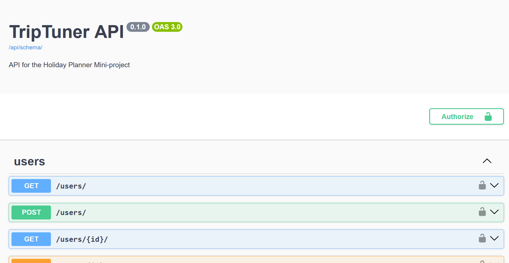
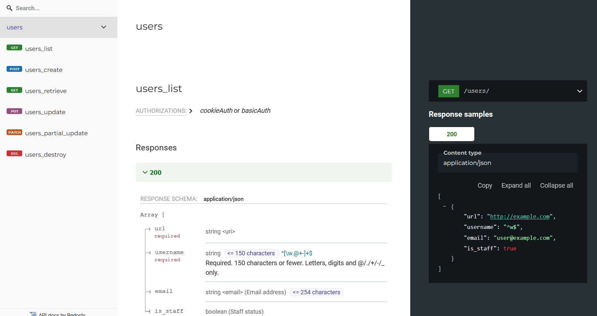

## TripTuner: A Holiday Planner Mini-project

### Technologies

- Django
  - Project was created with `django-admin startproject triptuner`
- Postgres


### Functionality

- Destinations: 
    - Listing available destinations (e.g., countries, cities, landmarks).
    - Searching/filtering destinations by attributes.
    - Retrieving detailed information about a selected destination.

- Travel Schedule:
    - Adding destinations to/from a travel itinerary.

- Trip weather information


### How to run?

- **Docker**
  - Have Docker installed
  - Run `docker compose up -d`
  - Apply migrations with `docker compose run api python manage.py migrate`
- **Locally**
  - Make sure Python `3.x` is installed with `python --version` or `python3 --version`
  - Use `venv` with `python3 -m venv .venv` and activate it with `source .venv/bin/activate` (Linux)
  - Install the requirements with `pip install --editable .[dev]`
  - To run:
    - Use the VSCode Launch Configuration called `Python Debugger: Django`, or run `python manage.py runserver`
    - Run migrations with the VSCode Launch Configuration called `Python Debugger: Run Migrations`, or run `python manage.py runserver migrate`
  - *Note*: You also need a Postgres server and database for the app to function. Set these environment variables (or place these in a `.env` file in the project root directory)
    - `POSTGRES_NAME`
    - `POSTGRES_USER`
    - `POSTGRES_PASSWORD`
    - `POSTGRES_HOST`
    - `POSTGRES_PORT`


### API Reference

You can create user credentials with `python manage.py createsuperuser`.

When running the application, the API reference is available here:

- Swagger documentation at `/api/schema/swagger-ui/`


- Redoc documentation at `/api/schema/redoc/`


*Internet access is required to use these*

### Development

We use [pre-commit](https://pre-commit.com/) for linting. First time setup may be required:
```shell
# Install pre-commit
pip install pre-commit

# Install the git hook scripts
pre-commit install

#(optional) Run against all the files
pre-commit run --all-files
```

### Automated Tests

Use the VSCode Launch Configuration called `Python Debugger: Run Integration Tests`, or run `python manage.py test`


### Limitations, known bugs, wishlist:

- We should use [Token Authentication](https://www.django-rest-framework.org/api-guide/authentication/#tokenauthentication) instead of basic authentication
- Itineraries can not be updated with `PUT` or `PATCH`
- We can use [uv](https://pypi.org/project/uv/) as package manager
  - I think this has a good chance of becoming the go-to package manager for future Python projects
  - Super fast and supports lockfiles (which makes depenedency tracking and vulnerability monitoring more robust)
- Caching: Since weather data doesn’t change rapidly, we could cache results for a short duration to optimize API calls and reduce load on third-party APIs.
- Time Zones: Consider different time zones for the destinations and align weather forecasts with the local time of each location
- Feature: Weather Preferences.
  - Allow users to input preferences, such as:
    - Temperature range (e.g., prefer warm destinations).
    - Weather conditions (e.g., prefer sunny days, avoid rainy days).
- Feature: User Authentication and Profiles
  - Allow users to create accounts or log in with third-party providers. User profiles could be linked to:
    - Saved itineraries.
    - Weather preferences
- Feature: Third-Party Integrations
  - Travel Services: Integrate with flight, accommodation, or transport APIs to offer booking suggestions or services based on the user’s itinerary
- Scalability & Performance
  - Rate Limits: Respect the rate limits of third-party weather APIs and implement strategies like caching and batching requests.
  - Load Handling: Consider how our API will scale to handle multiple users querying weather data simultaneously, especially during peak travel planning times.